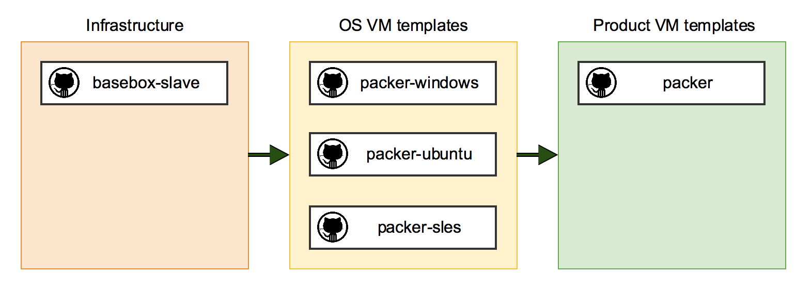

# Windows Templates for Packer

### Introduction

This repository is a fork of [joefitzgerald/packer-windows](http://github.comjoefitzgerald/packer-windows) to build Windows Vagrant boxes with Packer for VMware vCloud, VMware Workstation (and VirtualBox).

### Jenkins

To build these boxes in a Jenkins environment, have a look at the [basebox-slave](https://github.com/StefanScherer/basebox-slave) repo. Internally we use a [different setup](https://github.com/plossys/basebox-slave).

There are several GitHub repos for the complete build pipeline.
With this Jenkins we build OS VM templates as well as Product VM templates.

### Packer Version

[Packer](https://github.com/mitchellh/packer/blob/master/CHANGELOG.md) `0.10.1` or greater is required to build these boxes.

To build the vCloud templates you also need the Packer post processor  [vagrant-vmware-ovf](https://github.com/frapposelli/packer-post-processor-vagrant-vmware-ovf).
